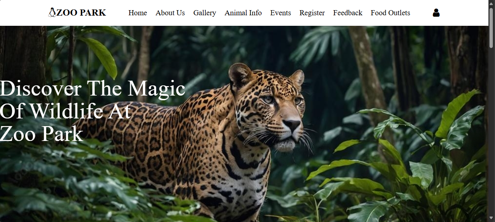
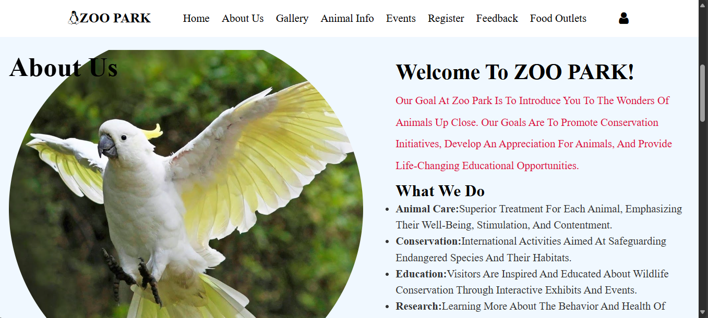
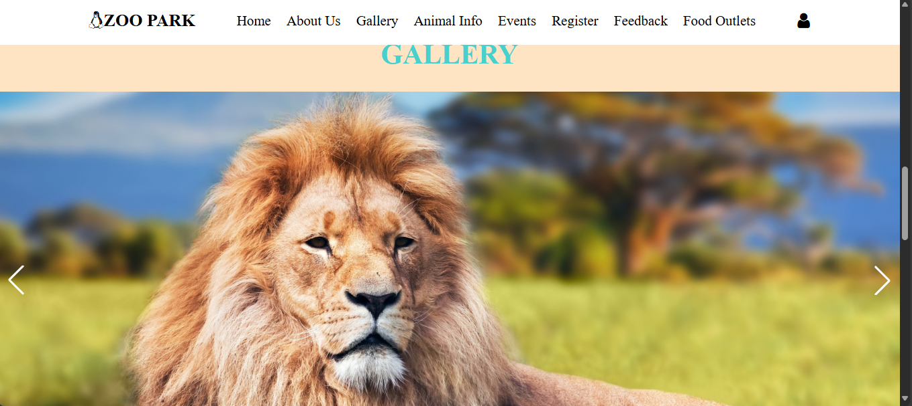
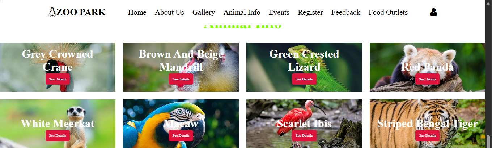
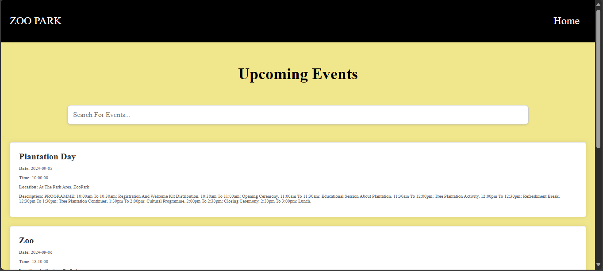
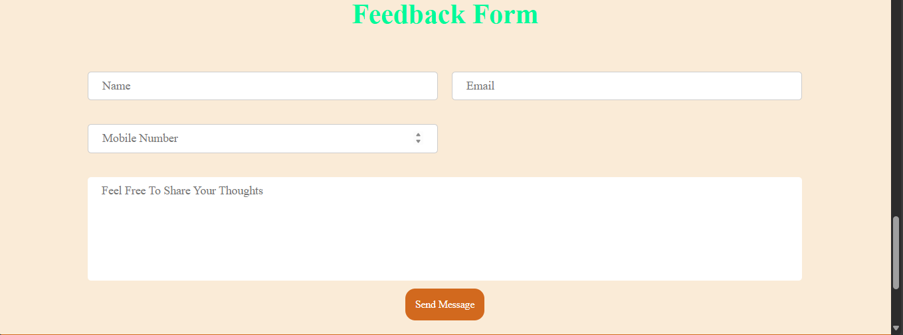
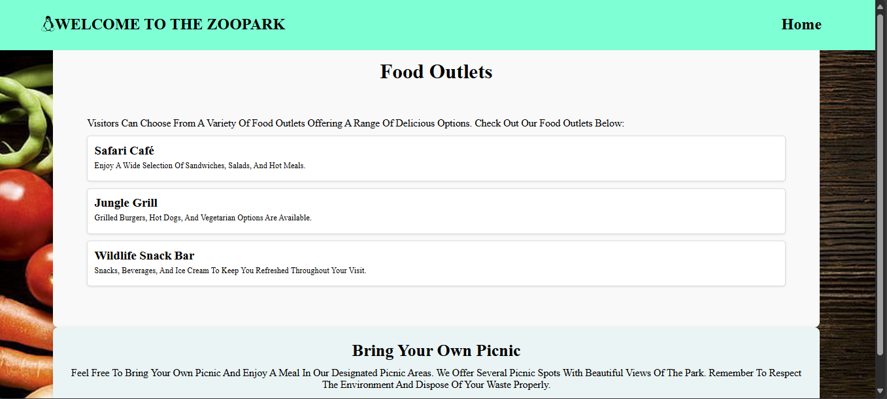
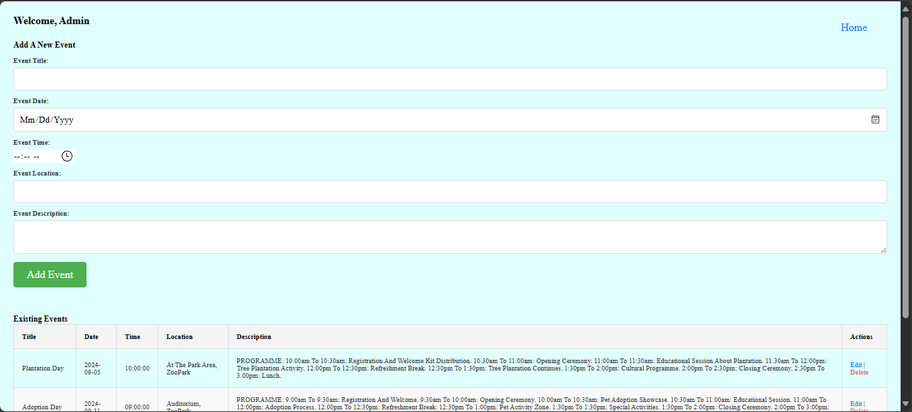

# Zoological Park Website

A zoological park website built using **HTML, CSS, JavaScript, PHP, and MySQL**.  
This system allows visitors to explore animals, events, and contact information.

## 🚀 Features
- 🦁 View animal information
- 📅 Event management (add, update, delete)
- 📷 Gallery
- 📩 Contact form
- 🔑 Admin panel (login required)

## 🛠️ Technologies Used
- HTML, CSS, JavaScript
- PHP (backend)
- MySQL (database)
- XAMPP (local server)

## 📂 How to Run
1. Install [XAMPP](https://www.apachefriends.org/).
2. Place this project folder inside the `htdocs` directory.
3. Import the provided `zoopark (1).sql` file into phpMyAdmin.
   - Open phpMyAdmin (http://localhost/phpmyadmin)
   - Create a new database named `zoopark`
   - Click Import → choose `database/zoopark.sql` → Go
4. Open a browser and go to: http://localhost/your-folder-name

## 📸 Screenshots

### 🏠 Home Page

### ℹ️ About Us Page

### 📷 Gallery Page

### 🐾 Animal Info Page

### 📅 Events Page

### ✉️ Feedback Form

### 🍔 Food Outlets Page

### 🔑 Admin Page

